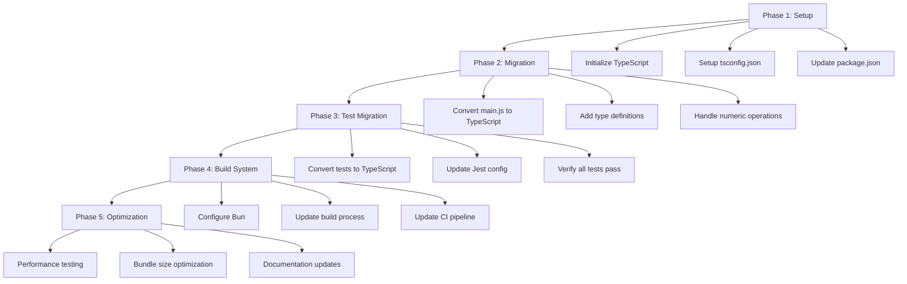

# TypeScript 5.8 and Bun.js Migration Plan

## Overview
This document outlines the plan for migrating the bloom-filter-js project to TypeScript 5.8 and integrating Bun.js as the new runtime and build system.

## Migration Flow



## Detailed Implementation Plan

### Phase 1: Setup
1. Initialize TypeScript and Bun:
   ```bash
   bun init
   ```

2. Create `tsconfig.json`:
   ```json
   {
     "compilerOptions": {
       "target": "ES2020",
       "module": "ESNext",
       "moduleResolution": "bundler",
       "strict": true,
       "declaration": true,
       "outDir": "dist",
       "rootDir": "src",
       "esModuleInterop": true,
       "skipLibCheck": true
     },
     "include": ["src/**/*"],
     "exclude": ["node_modules", "dist"]
   }
   ```

3. Update package.json:
   ```json
   {
     "type": "module",
     "scripts": {
       "test": "bun test",
       "build": "bun build ./src/main.ts --outdir ./dist",
       "typecheck": "tsc --noEmit"
     }
   }
   ```

### Phase 2: Migration

1. Core Type Definitions:
   ```typescript
   interface BloomFilterOptions {
     bitsPerElement?: number;
     estimatedNumberOfElements?: number;
     hashFns?: HashFunction[];
   }

   type HashFunction = (
     arrayValues: number[],
     lastHash?: number,
     lastCharCode?: number
   ) => number;

   interface SerializedBloomFilter {
     buffer: number[];
     hashFns?: HashFunction[];
   }
   ```

2. File Migration Steps:
   - Rename `main.js` to `main.ts`
   - Add type annotations to all functions
   - Implement proper error handling with types
   - Add generics where appropriate

### Phase 3: Test Migration

1. Test Suite Updates:
   - Rename `__tests__/main.js` to `__tests__/main.test.ts`
   - Add type coverage tests
   - Update test imports for TypeScript
   - Add edge case tests for numeric operations

2. Bun Test Configuration:
   ```typescript
   // bunfig.toml
   [test]
   preload = ["setup.ts"]
   coverage = true
   ```

### Phase 4: Build System (Bun Integration)

1. Bun Benefits for This Project:
   - Native TypeScript support without additional tooling
   - Faster test execution (up to 3x faster than Jest)
   - Built-in bundler with tree-shaking
   - Better performance for numeric operations
   - Zero-config test runner
   - ESM support out of the box

2. Build Process Updates:
   ```bash
   # Development
   bun run build
   
   # Testing
   bun test
   
   # Type checking
   bun run typecheck
   ```

3. CI Pipeline Updates:
   - Update .travis.yml for Bun
   - Add type checking step
   - Add bundle size check
   - Add performance benchmarks

### Phase 5: Optimization

1. Performance Benchmarks:
   ```typescript
   // benchmark.ts
   const benchmark = async () => {
     const filter = new BloomFilter();
     console.time('add');
     // Add benchmark implementation
     console.timeEnd('add');
   };
   ```

2. Bundle Size Optimization:
   - Configure Bun's bundler for optimal output
   - Implement tree-shaking
   - Monitor bundle size in CI

3. Documentation Updates:
   - Add TypeScript usage examples
   - Document Bun.js integration
   - Update API documentation with types
   - Add performance comparison metrics

## Risks and Mitigations

1. **Numeric Operation Precision**
   - Risk: TypeScript's type system might affect numeric operations
   - Mitigation: Use appropriate numeric types and add runtime checks

2. **Performance Impact**
   - Risk: Type system overhead
   - Mitigation: Leverage Bun's optimizations and monitor benchmarks

3. **Bundle Size**
   - Risk: Increased size due to type definitions
   - Mitigation: Use Bun's efficient bundler and tree-shaking

4. **Breaking Changes**
   - Risk: API changes due to stricter typing
   - Mitigation: Maintain backwards compatibility layer

## Success Criteria

1. All tests pass with TypeScript
2. No performance regression
3. Bundle size within acceptable limits
4. Full type coverage
5. Successful Bun.js integration
6. Updated documentation

## Manual Implementation Notes

If implementing this plan manually:

1. Start with Phase 1 setup steps
2. Test each phase thoroughly before moving to the next
3. Keep original JS files until TypeScript migration is complete
4. Run both old and new tests in parallel during migration
5. Monitor performance metrics throughout the process